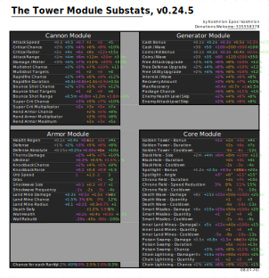
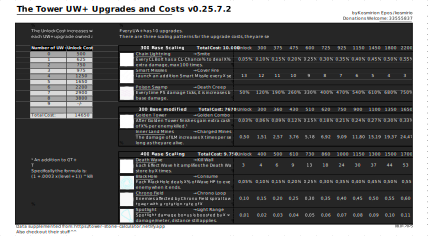
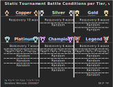

# The-Tower-Infographics
My host for my infographics I make for the ["The Tower - Idle Tower Defense" mobile game](https://play.google.com/store/apps/details?id=com.TechTreeGames.TheTower).

Hello every, if you made it here, welcome. I'm Kosmirion Epos. I've been playing The Tower for a while now and I kind of found a hobby of making infographics with it.

I am currently experimenting with transforming those graphics into vectorgraphics, as they are a lot smaller (e.g. for mobile users) and you can zoom in as far as you want/need. To my knowledge Discord does not support previews of .svg files though, which is why I will be trying to showcase the individual graphics here instead.

A friend also mentioned that with Xsolla now existing I should share my player ID. By all means, please do not feel obligated, I maintain these graphics to the best of my abilities because it is fun, I can learn new things and to give back to the community that allowed me to have e.g. the Starter Pack from a raffle. I have to agree though, that more power doritos etc. do help with making big number go bigger, which is always fun. So yeah, here it is: __335558378DD4C132__

## Milestone Lab Unlocks
At various breakpoints of Waves reached in the Tiers you don't only get currencies, but also unlock new, more or less powerfull researches. Because those aren't really visible until you get them, here's a handy-dandy table to look them up.

## Module Substats
Every Module type has a bunch of substats that you can get in various rarities. Here's an overview what the values are at those rarities and which stats exist.

## Ultimate Weapons PLUS
The endgame for Power Stones before Card Masteries were added. Pricey, so you probably would like to know what you'll get before you buy.

## Daily Rewards
Daily Missions got added and are a great source for some neat bonus stuff. But how much? Well, this table should answer it ^^

## Static Battle Conditions in Tournaments
Pretty self explanatory. Now that some Battle Conditions are permanently present and there's a known logic for all leagues, here's a quick look-up.

# Process
In case people are curious how I am doing these. I am organizing the data in Excel, then for the PNGs I use Excels "Copy as Image" feature
![alt text][CopyAsImageLocation] ![alt text][CopyAsImageSettingsPNG]

This copies the image to the clipboard. I then use [Paint.NET](https://www.getpaint.net/index.html) and paste the image there, increasing the document size when asked. There is a transparent border that I select using the wand tool. Ctrl + I inverses the selection and then Ctrl + Shift + X resizes the document to fit the selection. From there I just "Save as" to export.

For the vector graphics I recently found out that the standard option to copy an image in Excel actually is a vector graphics. I copy that and then paste that into [Inkscape](https://inkscape.org/). From there I simply save the file.

![alt text][CopyAsImageSettingsSVG]

In retrospect it's kind of obvious, but this doesn't work too well with images that are in the table. Those I do need to manually replace in both version. I also don't know yet where the random `%` signs come from, so don't worry about them.

For what it's worth, my PC seems to hate pasting that much xD, as Inkscape freezes for a few seconds each time.

[CopyAsImageLocation]: ./ReadMe Graphics/Excel Copy as Image location.png "On the top left, right of the Paste-button is the Copy-button. It has a dropdown arrow next to it. Click it and choose Copy as Image"
[CopyAsImageSettingsPNG]: ./ReadMe Graphics/Excel Copy as Image settings PNG.png "In the pop-up select Like printed"
[CopyAsImageSettingsSVG]: ./ReadMe Graphics/Excel Copy as Image settings SVG.png "After opening the Copy as Image pop-up like before I leave it at the default setting of as seen, as image"